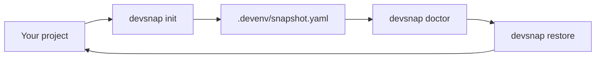

<div align="center">

# devsnap

### Freeze your stack. Restore with confidence.

**One binary** — snapshot **Node** & **Python** lockfiles, record toolchains, and get a **minimal doctor** that tells you what’s wrong before you waste an afternoon.

[](https://github.com/MioGlobalDev/devsnap/releases/latest)
[](LICENSE)
[](https://go.dev/)
[](https://github.com/MioGlobalDev/devsnap/releases)

[Releases](https://github.com/MioGlobalDev/devsnap/releases) · [Report issue](https://github.com/MioGlobalDev/devsnap/issues)

<br/>


</div>

---

## Why devsnap?

| | |
|:---|:---|
| **Reproducible** | Writes `.devenv/snapshot.yaml` with lockfile fingerprints and concrete `restore` steps. |
| **Honest** | Compares recorded **Node** / **Python** versions to your machine — warns, doesn’t silently “fix” your OS. |
| **Practical** | **pnpm** / **yarn** steps fall back through **`npx`** when the CLI isn’t on `PATH`. |
| **Tiny surface** | No servers, no cloud — just a CLI you run in the repo root. |

---

## At a glance



---

## Install

**Prebuilt (Windows amd64)** — grab the latest `devsnap-windows-amd64.exe` and optional `SHA256SUMS.txt` from [**Releases**](https://github.com/MioGlobalDev/devsnap/releases).

**From source**

```bash
git clone https://github.com/MioGlobalDev/devsnap.git
cd devsnap
go build -o devsnap ./cmd/devenv
```

The installed command is **`devsnap`**; **`devenv`** is registered as an alias.

---

## Commands

| Command | Alias | What it does |
|--------|--------|----------------|
| `init` | `freeze` | Scan the repo, write `.devenv/snapshot.yaml`, record toolchain versions. |
| `doctor` | — | Read the snapshot and print **Summary / Issues / Fix** (English output). |
| `restore` | — | Run the recorded install steps (shell). |
| `print` | — | Show snapshot content or paths (handy for CI logs). |
| `-V` / `--version` | — | Print the embedded version string. |

---

## Quick start

```bash
cd your-repo
devsnap init
devsnap doctor
devsnap restore
```

<details>
<summary><strong>Example: doctor output</strong></summary>

```text
[devsnap] Environment check

Summary:
  Node:   ISSUES
  Python: OK

Issues:
  - pnpm not found
    pnpm is not installed; npx fallback is available (already used by devsnap)

Fix:
  - pnpm not found
    - npm install -g pnpm
    - Or keep using: npx -y pnpm@9.15.4 ... (devsnap already falls back)
```

</details>

---

## What gets detected (Level 1)

| Stack | Signals | Restore direction |
|-------|---------|-------------------|
| **Node** | `pnpm-lock.yaml`, `package-lock.json`, `yarn.lock` | Install via the matching package manager (with **`npx`** fallback for pnpm/yarn when needed). |
| **Python** | `poetry.lock` + `pyproject.toml`, or `requirements.txt` | `poetry install` with fallback to **`pip install -r requirements.txt`** when Poetry isn’t enough; plain `requirements.txt` uses **pip**. |

Snapshot schema evolves with the tool; treat `.devenv/snapshot.yaml` as the source of truth for what was frozen.

---

## Examples in this repo

Under **`examples/`** you’ll find small fixtures (e.g. Node with pnpm/npm/yarn, Python with Poetry or requirements). Scripts **`scripts/test-examples.ps1`** and **`scripts/test-examples.sh`** run **init → doctor → restore** across them for regression checks.

---

## Project layout

```
cmd/devenv/          # main entrypoint
internal/cli/        # cobra commands
internal/snapshot/   # snapshot schema + I/O
internal/detectors/  # language / lockfile detection
internal/engine/     # orchestration
internal/runner/     # shell execution
```

---

## License

MIT — see [LICENSE](LICENSE).

---

<div align="center">

<sub>Built with Go · Single static binary · No telemetry</sub>

</div>
